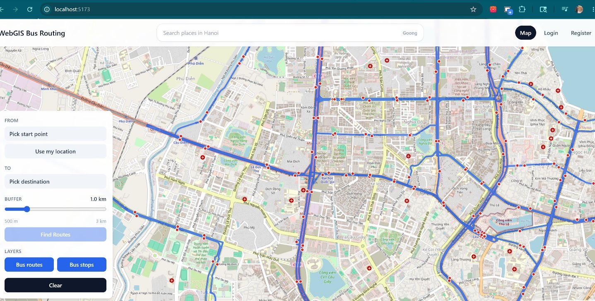
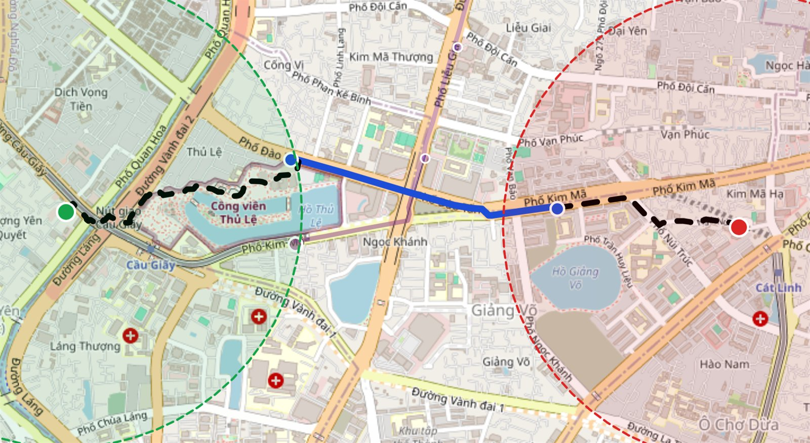
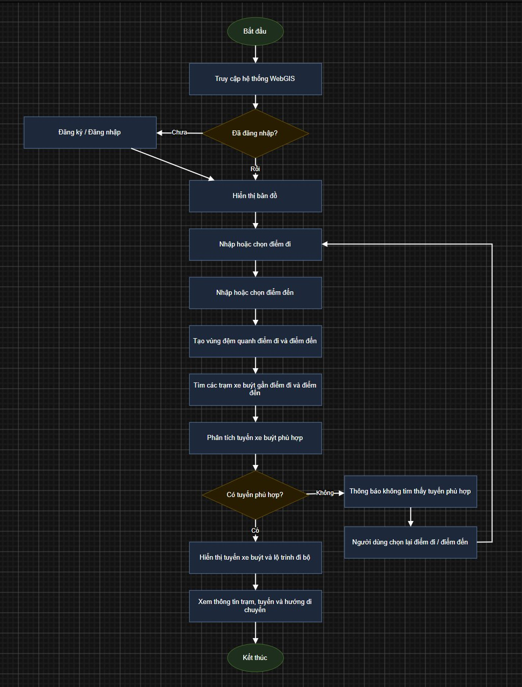
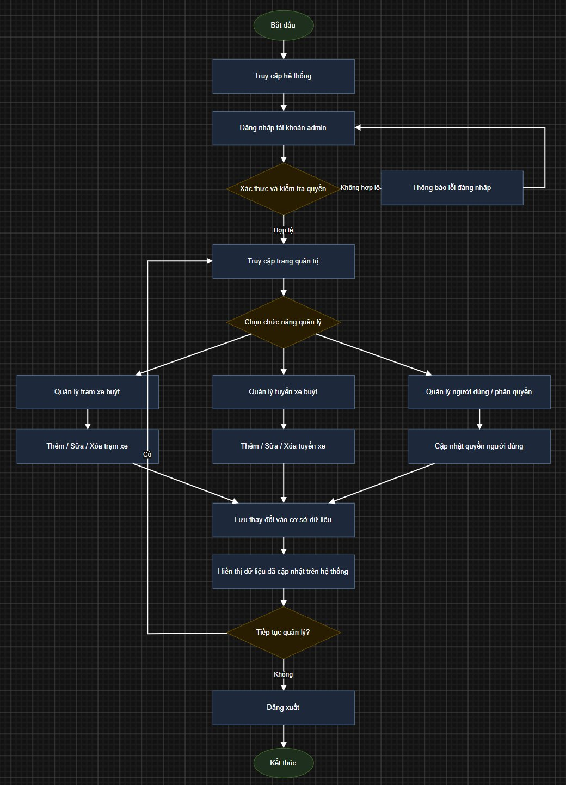

# WebGIS BusRouting

WebGIS BusRouting là ứng dụng WebGIS hỗ trợ hiển thị, quản lý và tìm kiếm tuyến xe buýt trên bản đồ. Hệ thống dùng dữ liệu xe buýt từ OpenStreetMap/GeoJSON, lưu trong PostgreSQL/PostGIS, publish lớp bản đồ bằng GeoServer WMS và hiển thị trên frontend React/OpenLayers.



*Giao diện chính hiển thị bản đồ nền, tuyến xe buýt, trạm xe buýt và bảng chọn điểm đi/điểm đến.*

## Chức Năng Chính

- Hiển thị bản đồ nền OpenStreetMap.
- Hiển thị lớp tuyến xe buýt và trạm xe buýt qua GeoServer WMS.
- Chọn điểm đi và điểm đến trực tiếp trên bản đồ.
- Lấy vị trí hiện tại của người dùng làm điểm đi.
- Tạo buffer quanh điểm đi và điểm đến để tìm trạm gần nhất.
- Tìm tuyến xe buýt trực tiếp giữa hai vị trí người dùng chọn.
- Hiển thị kết quả gồm mã tuyến, trạm lên xe, trạm xuống xe, số trạm, khoảng cách và danh sách trạm đi qua.
- Hiển thị hành trình gồm đoạn đi bộ và đoạn xe buýt trên bản đồ.
- Tìm kiếm địa điểm bằng Goong API và di chuyển bản đồ đến vị trí được chọn.
- Đăng ký, đăng nhập, đăng xuất và phân quyền user/admin.
- Admin có thể quản lý trạm xe và tuyến xe.


*Kết quả tìm tuyến gồm danh sách phương án bên phải và tuyến được vẽ trực tiếp trên bản đồ.*



*Hành trình sau khi chọn tuyến gồm đoạn đi bộ, đoạn xe buýt và buffer quanh điểm đi/điểm đến.*

## Công Nghệ Sử Dụng

| Thành phần | Công nghệ |
| --- | --- |
| Frontend | React, TypeScript, Vite, OpenLayers, Tailwind CSS |
| Backend | Django, Django REST Framework, GeoDjango |
| Database | PostgreSQL, PostGIS |
| Map Server | GeoServer WMS |
| Routing đi bộ | OSRM foot profile |
| Tìm kiếm địa điểm | Goong Places API |

## Kiến Trúc Tổng Quan

```text
Người dùng
   |
   v
Frontend React + OpenLayers
   |
   | gọi REST API
   v
Backend Django REST Framework
   |
   | truy vấn không gian
   v
PostgreSQL/PostGIS

GeoServer đọc dữ liệu PostGIS và publish lớp tuyến/trạm dưới dạng WMS.
Frontend gọi WMS từ GeoServer để hiển thị lên bản đồ.
```



*Luồng thao tác chính của người dùng: truy cập WebGIS, chọn điểm đi/đến, tìm tuyến và xem hành trình.*



*Luồng thao tác của admin: đăng nhập, kiểm tra quyền và quản lý dữ liệu tuyến/trạm.*

## Cấu Trúc Thư Mục

```text
WebGIS-BusRouting/
├─ backend/       # Django API, models, serializers, views, import GeoJSON
├─ frontend/      # React/OpenLayers WebGIS UI
├─ data/          # Dữ liệu GeoJSON đầu vào
├─ documents/     # Tài liệu FD/DD chia theo feature
├─ docker-compose.yml
├─ .env.example
└─ README.md
```

## Yêu Cầu Trước Khi Chạy

Cần cài trước:

- Python 3.11+ hoặc 3.12.
- Node.js 18+ hoặc 20+.
- PostgreSQL có bật PostGIS.
- Docker Desktop để chạy GeoServer.
- GDAL/GEOS phù hợp với GeoDjango trên Windows.

Tạo file `.env` từ mẫu:

```powershell
copy .env.example .env
```

Sau đó chỉnh các giá trị trong `.env`, đặc biệt là:

- `POSTGRES_DB`
- `POSTGRES_USER`
- `POSTGRES_PASSWORD`
- `POSTGRES_HOST`
- `POSTGRES_PORT`
- `DJANGO_SECRET_KEY`
- `GOONG_API_KEY`
- `GDAL_LIBRARY_PATH`
- `GEOS_LIBRARY_PATH`
- `VITE_API_URL`
- `VITE_GEOSERVER_URL`
- `VITE_GEOSERVER_WORKSPACE`

## Chạy GeoServer

Project dùng Docker Compose để chạy GeoServer:

```powershell
docker compose up -d
```

GeoServer chạy tại:

```text
http://localhost:8600/geoserver/web/
```

## Chạy Backend

Từ thư mục gốc project:

```powershell
cd backend
python -m venv .venv
.\.venv\Scripts\activate
pip install -r requirements.txt
python manage.py migrate
python manage.py runserver
```

Backend chạy tại:

```text
http://localhost:8000
```

API chính nằm dưới:

```text
http://localhost:8000/api/
```

## Import Dữ Liệu GeoJSON

Đặt dữ liệu GeoJSON tại:

```text
data/tay-ho-datas.geojson
```

Sau đó từ thư mục `backend`, chạy:

```powershell
python manage.py import_geojson ../data/tay-ho-datas.geojson --clear
```

Lệnh này sẽ đọc dữ liệu GeoJSON, import tuyến xe, trạm xe và quan hệ tuyến-trạm vào PostGIS.

## Cấu Hình GeoServer Layer

Sau khi dữ liệu đã có trong PostGIS, cấu hình GeoServer để publish các bảng:

- `routes_busroute`: lớp tuyến xe buýt.
- `routes_busstop`: lớp trạm xe buýt.

Frontend đang đọc cấu hình từ:

```text
VITE_GEOSERVER_URL=http://localhost:8600/geoserver
VITE_GEOSERVER_WORKSPACE=busrouting
```

Tên layer được cấu hình trong:

```text
frontend/src/utils/mapConfig.ts
```

## Chạy Frontend

Mở terminal mới từ thư mục gốc project:

```powershell
cd frontend
npm install
npm run dev
```

Frontend chạy tại:

```text
http://localhost:5173
```

## Tạo Tài Khoản Admin

Từ thư mục `backend`, chạy:

```powershell
python manage.py createsuperuser
```

Sau đó đăng nhập trên frontend. Tài khoản superuser có quyền admin và có thể truy cập khu vực quản lý dữ liệu.

## Các Đường Dẫn Quan Trọng

| Đường dẫn | Nội dung |
| --- | --- |
| `http://localhost:5173` | Giao diện WebGIS |
| `http://localhost:8000/api/` | Backend API |
| `http://localhost:8000/admin/` | Django Admin |
| `http://localhost:8600/geoserver/web/` | GeoServer |
| `http://localhost:5173/manage` | Khu vực quản lý dành cho admin |

## Tài Liệu Dự Án

Tài liệu chi tiết nằm trong thư mục `documents/`. Tài liệu được chia theo feature để dễ viết báo cáo:

| Feature | FD | DD |
| --- | --- | --- |
| Dữ liệu xe buýt | `documents/FD/FD-F01_Du_Lieu_Xe_Buyt.md` | `documents/DD/DD-F01_Du_Lieu_Xe_Buyt.md` |
| Bản đồ WMS | `documents/FD/FD-F02_Ban_Do_WMS.md` | `documents/DD/DD-F02_Ban_Do_WMS.md` |
| Chọn điểm và buffer | `documents/FD/FD-F03_Chon_Diem_Buffer.md` | `documents/DD/DD-F03_Chon_Diem_Buffer.md` |
| Tìm tuyến xe buýt | `documents/FD/FD-F04_Tim_Tuyen_Xe_Buyt.md` | `documents/DD/DD-F04_Tim_Tuyen_Xe_Buyt.md` |
| Hiển thị hành trình | `documents/FD/FD-F05_Hien_Thi_Hanh_Trinh.md` | `documents/DD/DD-F05_Hien_Thi_Hanh_Trinh.md` |
| Tìm kiếm Goong | `documents/FD/FD-F06_Tim_Kiem_Goong.md` | `documents/DD/DD-F06_Tim_Kiem_Goong.md` |
| Tài khoản và phân quyền | `documents/FD/FD-F07_Tai_Khoan_Phan_Quyen.md` | `documents/DD/DD-F07_Tai_Khoan_Phan_Quyen.md` |
| Quản lý dữ liệu admin | `documents/FD/FD-F08_Quan_Ly_Du_Lieu_Admin.md` | `documents/DD/DD-F08_Quan_Ly_Du_Lieu_Admin.md` |
| Kết luận và hướng phát triển | `documents/FD/FD-F09_Ket_Luan_Huong_Phat_Trien.md` | `documents/DD/DD-F09_Chay_Project.md` |

## Lỗi Thường Gặp

Nếu backend báo thiếu Django:

```powershell
cd backend
.\.venv\Scripts\activate
pip install -r requirements.txt
```

Nếu frontend không gọi được backend, kiểm tra:

- Backend đã chạy chưa.
- `VITE_API_URL` trong `.env` có đúng là `http://localhost:8000/api` không.
- Backend đã bật CORS/cookie cho frontend chưa.

Nếu không thấy lớp tuyến/trạm trên bản đồ, kiểm tra:

- GeoServer đã chạy chưa.
- Layer đã được publish chưa.
- Workspace trong GeoServer có đúng với `VITE_GEOSERVER_WORKSPACE` không.
- Tên layer có đúng là `routes_busroute` và `routes_busstop` không.

Nếu tìm tuyến không ra kết quả, kiểm tra:

- Đã chọn đủ điểm đi và điểm đến chưa.
- Buffer có quá nhỏ không.
- Dữ liệu `RouteStop.sequence` có đúng thứ tự trạm trên tuyến không.
- Dữ liệu tuyến/trạm đã được import vào PostGIS chưa.

## Ghi Chú

Trong project hiện tại, Goong API chỉ dùng để tìm kiếm địa điểm và di chuyển bản đồ đến vị trí được chọn. Goong không tự động gán kết quả tìm kiếm thành điểm đi hoặc điểm đến. Người dùng vẫn cần chọn điểm đi và điểm đến trực tiếp trên bản đồ.
